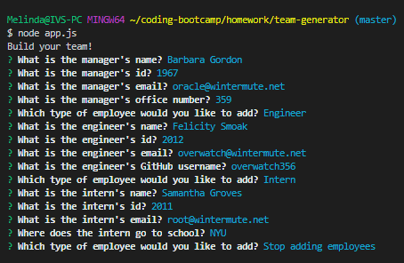
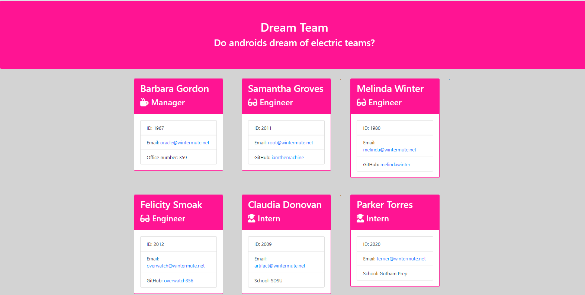
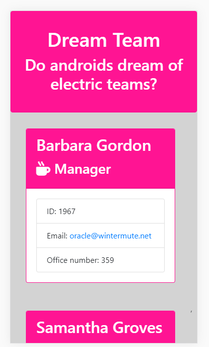

# Dream a Little Team for Me 

## Description

This is a cli app that will allow an employer to easily create a webpage with a team's contact information. It is currently set up for teams with one manager and a variety of engineers and interns but could be easily adapted for other teams. Please click the link below for a demonstration.

<https://drive.google.com/file/d/1cslRX4UwW5UMBMN3jik6dIJLvf5ED3MR/view?usp=sharing>

## Table of Contents

- [Installation](#installation)
- [Usage](#usage)
- [License](#license)
- [Contributing](#contributing)
- [Tests](#tests)
- [Questions](#questions)
- [Credits](#credits)

## Installation

If you would like to use this generator, please clone my project. Make sure you have node.js installed on your computer. You can find the download here <https://nodejs.org/en/download/>.

## Usage

Once you have a cloned version, open it up in VS Code or another editor. Open up your terminal and make sure you are in the correct directory folder. Type node app.js into the command line and press Enter.

A formatted webpage will be generated.

## License

GNU General Public License v3.0

The GNU License allows the software to be modified and distributed by other users. It does not impose any restrictions on the use of the software but requires that it remain open source.

## Contributing

Please contribute to this project if you feel that you can make the code more efficient or if you'd like to add more questions for the user. Create your own branch from the Master and submit a pull request. I ask that you follow the Contributor Covenant code of conduct: <https://www.contributor-covenant.org/version/2/0/code_of_conduct/code_of_conduct.md> 

## Tests

To run the tests for the project, type npm run test into the command line.

## Questions

- [Github Profile](https://github.com/melindawinter)
- melindawinter42@gmail.com
- You can easily reach me by email or you can find me on LinkedIn here <http://www.linkedin.com/in/melinda-winter-34a25689>.

## Credits

A big thank you to my team members Cyrus Jose and Kate An for helping me to get this working! Thank you to Adam Abundis for all the resources and the extra class tutoring session. Thanks to Thor Nolan, my very awesome tutor who helped me get started on this project.
